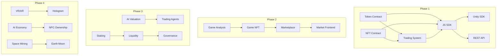

# Flux Blockchain - 상세 태스크 분해

## 개요
각 주요 태스크를 3-5개의 상세 하위 태스크로 분해한 문서입니다. 각 하위 태스크는 1-3일 내에 완료 가능한 단위로 구성되었습니다.

---

## Phase 1: MVP - Basic Infrastructure (0-3개월)

### 1.1 스마트 컨트랙트 개발

#### TASK-001: Core Token Contract Implementation (5일)
##### TASK-001-1: 토큰 컨트랙트 기본 구조 설계
- **설명**: ERC-20 표준 인터페이스 및 기본 구조 설계
- **소요 시간**: 0.5일
- **산출물**: 
  - Token.sol 인터페이스 정의
  - 상태 변수 설계 문서
  - 함수 시그니처 정의

##### TASK-001-2: 핵심 토큰 기능 구현
- **설명**: transfer, approve, transferFrom 등 핵심 ERC-20 함수 구현
- **소요 시간**: 1.5일
- **산출물**: 
  - 핵심 함수 구현 코드
  - 가스 최적화 적용
  - 내부 함수 구현

##### TASK-001-3: 확장 기능 구현
- **설명**: mint, burn, pause 기능 추가
- **소요 시간**: 1일
- **산출물**: 
  - Mintable 기능
  - Burnable 기능
  - Pausable 기능
  - Access Control 통합

##### TASK-001-4: 토큰 컨트랙트 테스트 작성
- **설명**: 단위 테스트 및 통합 테스트 작성
- **소요 시간**: 1.5일
- **산출물**: 
  - 100% 코드 커버리지
  - Edge case 테스트
  - Gas 사용량 리포트

##### TASK-001-5: 보안 검토 및 최적화
- **설명**: 내부 보안 검토 및 가스 최적화
- **소요 시간**: 0.5일
- **산출물**: 
  - 보안 체크리스트 완료
  - 가스 최적화 리포트
  - Slither 분석 결과

#### TASK-002: NFT Contract Implementation (7일)
##### TASK-002-1: NFT 컨트랙트 아키텍처 설계
- **설명**: ERC-721/1155 듀얼 지원 구조 설계
- **소요 시간**: 1일
- **산출물**: 
  - NFT 컨트랙트 구조도
  - 메타데이터 스키마
  - 스토리지 패턴 설계

##### TASK-002-2: ERC-721 구현
- **설명**: 기본 ERC-721 표준 구현
- **소요 시간**: 1.5일
- **산출물**: 
  - GameAssetNFT.sol
  - 메타데이터 URI 시스템
  - Enumerable 확장

##### TASK-002-3: ERC-1155 구현
- **설명**: 멀티 토큰 표준 구현
- **소요 시간**: 1.5일
- **산출물**: 
  - GameItemNFT.sol
  - Batch 전송 기능
  - 멀티 토큰 관리 시스템

##### TASK-002-4: 로열티 시스템 구현
- **설명**: EIP-2981 로열티 표준 구현
- **소요 시간**: 1일
- **산출물**: 
  - 로열티 계산 로직
  - 수령인 관리
  - 마켓플레이스 통합 인터페이스

##### TASK-002-5: NFT 테스트 및 최적화
- **설명**: NFT 컨트랙트 종합 테스트
- **소요 시간**: 2일
- **산출물**: 
  - 민팅 테스트
  - 전송 테스트
  - 대량 작업 가스 최적화

#### TASK-003: Basic Trading System (10일)
##### TASK-003-1: 거래 시스템 설계
- **설명**: P2P 거래 아키텍처 및 데이터 구조 설계
- **소요 시간**: 1.5일
- **산출물**: 
  - 거래 상태 머신 설계
  - 에스크로 패턴 정의
  - 이벤트 구조 설계

##### TASK-003-2: 토큰 거래 구현
- **설명**: ERC-20 토큰 간 거래 기능
- **소요 시간**: 2일
- **산출물**: 
  - TokenSwap.sol
  - 가격 오라클 연동
  - 부분 체결 기능

##### TASK-003-3: NFT 거래 구현
- **설명**: NFT 거래 및 경매 시스템
- **소요 시간**: 2.5일
- **산출물**: 
  - NFTMarketplace.sol
  - 고정가 판매
  - 경매 시스템
  - 번들 거래

##### TASK-003-4: 거래 취소 및 환불 시스템
- **설명**: 안전한 거래 취소 메커니즘
- **소요 시간**: 1.5일
- **산출물**: 
  - 취소 로직
  - 환불 처리
  - 타임아웃 관리

##### TASK-003-5: 거래 시스템 테스트
- **설명**: 거래 시나리오 종합 테스트
- **소요 시간**: 2.5일
- **산출물**: 
  - 정상 거래 테스트
  - 실패 시나리오 테스트
  - 프론트러닝 방지 테스트

#### TASK-004: Access Control System (3일)
##### TASK-004-1: 역할 기반 접근 제어 설계
- **설명**: RBAC 시스템 아키텍처 설계
- **소요 시간**: 0.5일
- **산출물**: 
  - 역할 계층 구조
  - 권한 매트릭스
  - 상속 구조

##### TASK-004-2: AccessControl 컨트랙트 구현
- **설명**: OpenZeppelin 기반 커스텀 구현
- **소요 시간**: 1일
- **산출물**: 
  - FluxAccessControl.sol
  - 다중 역할 지원
  - 역할 위임 기능

##### TASK-004-3: 컨트랙트 통합
- **설명**: 모든 컨트랙트에 접근 제어 적용
- **소요 시간**: 1일
- **산출물**: 
  - 토큰 컨트랙트 통합
  - NFT 컨트랙트 통합
  - 거래 시스템 통합

##### TASK-004-4: 접근 제어 테스트
- **설명**: 권한 시스템 보안 테스트
- **소요 시간**: 0.5일
- **산출물**: 
  - 권한 상승 테스트
  - 역할 전환 테스트
  - 비상 정지 테스트

### 1.2 SDK 개발

#### TASK-005: JavaScript/TypeScript SDK Core (14일)
##### TASK-005-1: SDK 아키텍처 설계
- **설명**: 모듈화된 SDK 구조 설계
- **소요 시간**: 2일
- **산출물**: 
  - SDK 폴더 구조
  - 인터페이스 정의
  - 의존성 관리 전략

##### TASK-005-2: 지갑 연결 모듈
- **설명**: 다양한 지갑 프로바이더 지원
- **소요 시간**: 3일
- **산출물**: 
  - WalletConnector 클래스
  - MetaMask 지원
  - WalletConnect 지원
  - 지갑 상태 관리

##### TASK-005-3: 컨트랙트 인터랙션 래퍼
- **설명**: 타입 안전한 컨트랙트 호출 래퍼
- **소요 시간**: 3일
- **산출물**: 
  - Contract 클래스들
  - 자동 생성 타입
  - 트랜잭션 빌더

##### TASK-005-4: 이벤트 시스템
- **설명**: 실시간 블록체인 이벤트 처리
- **소요 시간**: 2일
- **산출물**: 
  - EventListener 클래스
  - 이벤트 필터링
  - 재연결 로직

##### TASK-005-5: 유틸리티 및 헬퍼
- **설명**: 공통 유틸리티 함수
- **소요 시간**: 2일
- **산출물**: 
  - 단위 변환
  - 주소 검증
  - 서명 유틸리티

##### TASK-005-6: 문서화 및 예제
- **설명**: SDK 문서 및 샘플 코드
- **소요 시간**: 2일
- **산출물**: 
  - API 문서
  - 시작 가이드
  - 예제 프로젝트

#### TASK-006: Unity SDK Basic Implementation (21일)
##### TASK-006-1: Unity 프로젝트 설정
- **설명**: Unity SDK 기본 구조 설정
- **소요 시간**: 2일
- **산출물**: 
  - Unity 패키지 구조
  - 의존성 설정
  - 빌드 파이프라인

##### TASK-006-2: WebGL 지갑 연동
- **설명**: 브라우저 지갑과 Unity WebGL 연동
- **소요 시간**: 5일
- **산출물**: 
  - JavaScript 브리지
  - Unity-JS 통신
  - 지갑 UI 컴포넌트

##### TASK-006-3: 모바일 지갑 연동
- **설명**: iOS/Android 네이티브 지갑 연동
- **소요 시간**: 5일
- **산출물**: 
  - WalletConnect Unity
  - 딥링크 처리
  - 네이티브 플러그인

##### TASK-006-4: 스마트 컨트랙트 C# 래퍼
- **설명**: 컨트랙트 호출을 위한 C# 인터페이스
- **소요 시간**: 4일
- **산출물**: 
  - Contract 클래스들
  - 비동기 호출 시스템
  - 에러 처리

##### TASK-006-5: Unity UI 컴포넌트
- **설명**: 재사용 가능한 블록체인 UI 요소
- **소요 시간**: 3일
- **산출물**: 
  - 지갑 연결 UI
  - 트랜잭션 상태 UI
  - NFT 갤러리 컴포넌트

##### TASK-006-6: 샘플 게임 프로젝트
- **설명**: SDK 사용 예제 게임
- **소요 시간**: 2일
- **산출물**: 
  - 간단한 NFT 수집 게임
  - 토큰 보상 시스템
  - 마켓플레이스 통합

#### TASK-007: REST API Development (10일)
##### TASK-007-1: API 서버 설정
- **설명**: NestJS 기반 API 서버 구축
- **소요 시간**: 1.5일
- **산출물**: 
  - 프로젝트 구조
  - 환경 설정
  - 로깅 시스템

##### TASK-007-2: 인증 시스템
- **설명**: API 키 및 JWT 기반 인증
- **소요 시간**: 2일
- **산출물**: 
  - API 키 관리
  - JWT 발급/검증
  - Rate limiting

##### TASK-007-3: 블록체인 서비스 레이어
- **설명**: 블록체인 상호작용 추상화
- **소요 시간**: 2.5일
- **산출물**: 
  - Web3 서비스
  - 트랜잭션 관리
  - 가스 추정

##### TASK-007-4: API 엔드포인트 구현
- **설명**: RESTful API 엔드포인트
- **소요 시간**: 2.5일
- **산출물**: 
  - 토큰 API
  - NFT API
  - 거래 API
  - 사용자 API

##### TASK-007-5: API 문서화
- **설명**: OpenAPI/Swagger 문서
- **소요 시간**: 1.5일
- **산출물**: 
  - Swagger UI
  - API 스펙 문서
  - 사용 예제

### 1.3 개발 인프라

#### TASK-008: Development Environment Setup (7일)
##### TASK-008-1: 개발 환경 자동화
- **설명**: 개발 환경 설정 스크립트
- **소요 시간**: 1.5일
- **산출물**: 
  - Docker 설정
  - 로컬 블록체인
  - 환경 변수 템플릿

##### TASK-008-2: 테스트넷 배포 파이프라인
- **설명**: 자동화된 테스트넷 배포
- **소요 시간**: 2일
- **산출물**: 
  - 배포 스크립트
  - CI/CD 파이프라인
  - 롤백 절차

##### TASK-008-3: 모니터링 설정
- **설명**: 컨트랙트 및 API 모니터링
- **소요 시간**: 2일
- **산출물**: 
  - Grafana 대시보드
  - 알림 설정
  - 로그 수집

##### TASK-008-4: 개발자 도구
- **설명**: 디버깅 및 테스트 도구
- **소요 시간**: 1.5일
- **산출물**: 
  - 컨트랙트 검증 도구
  - 트랜잭션 시뮬레이터
  - 가스 계산기

#### TASK-009: Testing Framework (5일)
##### TASK-009-1: 테스트 전략 수립
- **설명**: 종합적인 테스트 계획
- **소요 시간**: 1일
- **산출물**: 
  - 테스트 전략 문서
  - 커버리지 목표
  - 테스트 케이스 목록

##### TASK-009-2: 단위 테스트 프레임워크
- **설명**: 스마트 컨트랙트 단위 테스트
- **소요 시간**: 1.5일
- **산출물**: 
  - Hardhat 테스트 설정
  - 테스트 헬퍼 함수
  - 모의 객체

##### TASK-009-3: 통합 테스트
- **설명**: 시스템 통합 테스트
- **소요 시간**: 1.5일
- **산출물**: 
  - E2E 테스트 시나리오
  - 크로스 컨트랙트 테스트
  - 성능 테스트

##### TASK-009-4: 보안 테스트
- **설명**: 자동화된 보안 검사
- **소요 시간**: 1일
- **산출물**: 
  - Slither 통합
  - Mythril 설정
  - 취약점 스캔

#### TASK-010: Contract Deployment Tools (3일)
##### TASK-010-1: 배포 스크립트
- **설명**: 자동화된 컨트랙트 배포
- **소요 시간**: 1일
- **산출물**: 
  - 배포 스크립트
  - 환경별 설정
  - 배포 검증

##### TASK-010-2: 업그레이드 시스템
- **설명**: 프록시 패턴 구현
- **소요 시간**: 1.5일
- **산출물**: 
  - 업그레이드 프록시
  - 마이그레이션 스크립트
  - 버전 관리

##### TASK-010-3: 배포 문서화
- **설명**: 배포 가이드 작성
- **소요 시간**: 0.5일
- **산출물**: 
  - 배포 가이드
  - 트러블슈팅
  - 체크리스트

#### TASK-011: Documentation System (5일)
##### TASK-011-1: 문서 사이트 구축
- **설명**: Docusaurus 기반 문서 사이트
- **소요 시간**: 1.5일
- **산출물**: 
  - 문서 사이트 구조
  - 테마 커스터마이징
  - 검색 기능

##### TASK-011-2: 기술 문서 작성
- **설명**: 개발자 가이드 작성
- **소요 시간**: 2일
- **산출물**: 
  - API 레퍼런스
  - 스마트 컨트랙트 문서
  - 아키텍처 가이드

##### TASK-011-3: 튜토리얼 작성
- **설명**: 단계별 학습 자료
- **소요 시간**: 1.5일
- **산출물**: 
  - 시작하기 가이드
  - 통합 튜토리얼
  - 비디오 튜토리얼

#### TASK-012: Security Audit Preparation (5일)
##### TASK-012-1: 내부 보안 검토
- **설명**: 자체 보안 감사
- **소요 시간**: 2일
- **산출물**: 
  - 보안 체크리스트
  - 취약점 분석
  - 수정 사항

##### TASK-012-2: 감사 문서 준비
- **설명**: 외부 감사를 위한 문서
- **소요 시간**: 1.5일
- **산출물**: 
  - 시스템 설명서
  - 위협 모델
  - 테스트 결과

##### TASK-012-3: 감사 도구 설정
- **설명**: 자동화된 보안 도구
- **소요 시간**: 1.5일
- **산출물**: 
  - 정적 분석 도구
  - 동적 분석 설정
  - 지속적 모니터링

---

## Phase 2: Game Integration (3-6개월)

### 2.1 Flux Game 통합

#### TASK-013: Game Asset Analysis (5일)
##### TASK-013-1: 게임 자산 목록화
- **설명**: 토큰화 가능한 게임 자산 식별
- **소요 시간**: 1.5일
- **산출물**: 
  - 자산 카테고리 분류
  - 메타데이터 스키마
  - 희귀도 시스템

##### TASK-013-2: 게임 경제 분석
- **설명**: 기존 게임 경제 시스템 분석
- **소요 시간**: 1.5일
- **산출물**: 
  - 재화 흐름도
  - 밸런스 분석
  - 토큰 이코노미 설계

##### TASK-013-3: 기술 통합 포인트 식별
- **설명**: 블록체인 통합 지점 매핑
- **소요 시간**: 1일
- **산출물**: 
  - API 통합 포인트
  - 데이터 동기화 전략
  - 성능 요구사항

##### TASK-013-4: 통합 아키텍처 설계
- **설명**: 게임-블록체인 통합 구조
- **소요 시간**: 1일
- **산출물**: 
  - 시스템 아키텍처
  - 데이터 플로우
  - 보안 고려사항

#### TASK-014: Game Item NFT Implementation (10일)
##### TASK-014-1: NFT 메타데이터 표준 정의
- **설명**: 게임 아이템 NFT 표준
- **소요 시간**: 2일
- **산출물**: 
  - 메타데이터 JSON 스키마
  - 온체인/오프체인 데이터 분리
  - IPFS 통합

##### TASK-014-2: 게임 아이템 NFT 컨트랙트
- **설명**: 게임 특화 NFT 구현
- **소요 시간**: 3일
- **산출물**: 
  - GameItem.sol
  - 업그레이드 시스템
  - 합성 기능

##### TASK-014-3: 대량 민팅 시스템
- **설명**: 효율적인 대량 NFT 발행
- **소요 시간**: 2일
- **산출물**: 
  - Batch 민팅
  - Lazy 민팅
  - 가스 최적화

##### TASK-014-4: 게임 서버 통합
- **설명**: 게임 서버와 블록체인 동기화
- **소요 시간**: 3일
- **산출물**: 
  - 동기화 서비스
  - 캐싱 레이어
  - 실패 복구

#### TASK-015: In-game Currency Tokenization (7일)
##### TASK-015-1: 게임 재화 토큰 설계
- **설명**: 인게임 재화의 토큰화
- **소요 시간**: 1.5일
- **산출물**: 
  - 토큰 이코노미 모델
  - 환율 시스템
  - 인플레이션 제어

##### TASK-015-2: 브리지 컨트랙트 구현
- **설명**: 게임-블록체인 재화 브리지
- **소요 시간**: 2.5일
- **산출물**: 
  - CurrencyBridge.sol
  - 입출금 로직
  - 한도 관리

##### TASK-015-3: 게임 내 지갑 시스템
- **설명**: 심리스한 지갑 경험
- **소요 시간**: 2일
- **산출물**: 
  - 커스터디얼 지갑
  - 가스리스 거래
  - 계정 복구

##### TASK-015-4: 재화 교환 인터페이스
- **설명**: 사용자 친화적 교환 UI
- **소요 시간**: 1일
- **산출물**: 
  - 교환 UI/UX
  - 실시간 환율
  - 거래 내역

#### TASK-016: Achievement System Integration (5일)
##### TASK-016-1: 업적 NFT 설계
- **설명**: 소울바운드 업적 토큰
- **소요 시간**: 1일
- **산출물**: 
  - SBT 표준
  - 업적 카테고리
  - 레벨 시스템

##### TASK-016-2: 업적 발급 시스템
- **설명**: 자동화된 업적 민팅
- **소요 시간**: 2일
- **산출물**: 
  - 업적 검증 로직
  - 자동 발급 시스템
  - 중복 방지

##### TASK-016-3: 업적 디스플레이
- **설명**: 업적 전시 시스템
- **소요 시간**: 1.5일
- **산출물**: 
  - 프로필 시스템
  - 업적 갤러리
  - 소셜 공유

##### TASK-016-4: 리더보드 통합
- **설명**: 온체인 리더보드
- **소요 시간**: 0.5일
- **산출물**: 
  - 점수 집계
  - 순위 시스템
  - 보상 분배

### 2.2 마켓플레이스 개발

#### TASK-017: Marketplace Smart Contracts (10일)
##### TASK-017-1: 마켓플레이스 아키텍처
- **설명**: 확장 가능한 마켓 구조
- **소요 시간**: 2일
- **산출물**: 
  - 모듈화 설계
  - 수수료 구조
  - 거버넌스 통합

##### TASK-017-2: 고정가 판매 구현
- **설명**: 기본 판매 기능
- **소요 시간**: 2일
- **산출물**: 
  - 리스팅 시스템
  - 구매 프로세스
  - 수수료 분배

##### TASK-017-3: 경매 시스템 구현
- **설명**: 다양한 경매 방식
- **소요 시간**: 3일
- **산출물**: 
  - 영국식 경매
  - 네덜란드식 경매
  - 봉인 입찰

##### TASK-017-4: 번들 거래 시스템
- **설명**: 다중 아이템 거래
- **소요 시간**: 2일
- **산출물**: 
  - 번들 생성
  - 원자적 거래
  - 부분 거래

##### TASK-017-5: 로열티 분배 시스템
- **설명**: 자동 로열티 정산
- **소요 시간**: 1일
- **산출물**: 
  - 로열티 계산
  - 다중 수령인
  - 분배 최적화

#### TASK-018: Marketplace Frontend (14일)
##### TASK-018-1: UI/UX 설계
- **설명**: 사용자 친화적 마켓 디자인
- **소요 시간**: 3일
- **산출물**: 
  - 와이어프레임
  - 디자인 시스템
  - 프로토타입

##### TASK-018-2: 상품 탐색 시스템
- **설명**: 효율적인 NFT 검색
- **소요 시간**: 3일
- **산출물**: 
  - 필터링 시스템
  - 정렬 옵션
  - 카테고리 분류

##### TASK-018-3: 상세 페이지 구현
- **설명**: NFT 상세 정보 표시
- **소요 시간**: 2일
- **산출물**: 
  - 메타데이터 표시
  - 거래 히스토리
  - 가격 차트

##### TASK-018-4: 거래 인터페이스
- **설명**: 구매/판매 프로세스
- **소요 시간**: 3일
- **산출물**: 
  - 리스팅 폼
  - 구매 플로우
  - 거래 확인

##### TASK-018-5: 사용자 대시보드
- **설명**: 개인 거래 관리
- **소요 시간**: 3일
- **산출물**: 
  - 포트폴리오 뷰
  - 거래 내역
  - 수익 분석

#### TASK-019: Price Discovery System (5일)
##### TASK-019-1: 가격 오라클 설계
- **설명**: 신뢰할 수 있는 가격 정보
- **소요 시간**: 1.5일
- **산출물**: 
  - 오라클 아키텍처
  - 데이터 소스
  - 집계 알고리즘

##### TASK-019-2: 가격 추적 시스템
- **설명**: 실시간 가격 모니터링
- **소요 시간**: 1.5일
- **산출물**: 
  - 가격 인덱서
  - 히스토리 저장
  - API 엔드포인트

##### TASK-019-3: 가격 알림 시스템
- **설명**: 사용자 알림 서비스
- **소요 시간**: 1일
- **산출물**: 
  - 알림 설정
  - 푸시 알림
  - 이메일 통합

##### TASK-019-4: 시장 분석 도구
- **설명**: 거래 분석 대시보드
- **소요 시간**: 1일
- **산출물**: 
  - 거래량 차트
  - 가격 트렌드
  - 인기 아이템

### 2.3 지갑 통합

#### TASK-020: Wallet Integration Framework (7일)
##### TASK-020-1: 지갑 추상화 레이어
- **설명**: 통합 지갑 인터페이스
- **소요 시간**: 2일
- **산출물**: 
  - 지갑 어댑터 패턴
  - 공통 인터페이스
  - 에러 처리

##### TASK-020-2: 멀티체인 지원
- **설명**: 다중 블록체인 지갑 관리
- **소요 시간**: 2일
- **산출물**: 
  - 체인 전환
  - 주소 관리
  - 네트워크 감지

##### TASK-020-3: 지갑 상태 관리
- **설명**: 전역 지갑 상태 시스템
- **소요 시간**: 1.5일
- **산출물**: 
  - 상태 저장소
  - 동기화 로직
  - 세션 관리

##### TASK-020-4: 보안 강화
- **설명**: 지갑 보안 기능
- **소요 시간**: 1.5일
- **산출물**: 
  - 트랜잭션 검증
  - 피싱 방지
  - 안전 모드

#### TASK-021: Social Login Integration (10일)
##### TASK-021-1: OAuth 통합 설계
- **설명**: 소셜 로그인 아키텍처
- **소요 시간**: 2일
- **산출물**: 
  - 인증 플로우
  - 제공자 통합
  - 세션 관리

##### TASK-021-2: Web3Auth 통합
- **설명**: 이메일/소셜 지갑 생성
- **소요 시간**: 3일
- **산출물**: 
  - Web3Auth SDK 통합
  - 키 관리
  - 복구 시스템

##### TASK-021-3: 제공자별 구현
- **설명**: 각 소셜 플랫폼 통합
- **소요 시간**: 3일
- **산출물**: 
  - Google 로그인
  - Discord 로그인
  - Twitter 로그인

##### TASK-021-4: 온보딩 플로우
- **설명**: 신규 사용자 경험
- **소요 시간**: 2일
- **산출물**: 
  - 가이드 투어
  - 지갑 생성
  - 초기 자금

#### TASK-022: Mobile Wallet Support (7일)
##### TASK-022-1: 모바일 지갑 SDK
- **설명**: iOS/Android 지갑 통합
- **소요 시간**: 2.5일
- **산출물**: 
  - WalletConnect v2
  - 딥링크 처리
  - QR 코드 스캔

##### TASK-022-2: 인앱 브라우저 대응
- **설명**: 모바일 앱 내 지갑
- **소요 시간**: 2일
- **산출물**: 
  - 브라우저 감지
  - 지갑 주입
  - 폴백 처리

##### TASK-022-3: 푸시 알림
- **설명**: 모바일 거래 알림
- **소요 시간**: 1.5일
- **산출물**: 
  - FCM 통합
  - 거래 알림
  - 프로모션 알림

##### TASK-022-4: 생체 인증
- **설명**: 지문/Face ID 통합
- **소요 시간**: 1일
- **산출물**: 
  - 생체 인증
  - 보안 저장소
  - 폴백 옵션

---

## Phase 3: Advanced Features (6-12개월)

### 3.1 AI 통합

#### TASK-023: AI Valuation Model (14일)
##### TASK-023-1: 데이터 수집 파이프라인
- **설명**: NFT 거래 데이터 수집
- **소요 시간**: 3일
- **산출물**: 
  - 데이터 크롤러
  - ETL 파이프라인
  - 데이터 웨어하우스

##### TASK-023-2: 특성 추출 시스템
- **설명**: NFT 특성 분석
- **소요 시간**: 3일
- **산출물**: 
  - 메타데이터 파서
  - 이미지 분석
  - 희귀도 계산

##### TASK-023-3: ML 모델 개발
- **설명**: 가격 예측 모델
- **소요 시간**: 4일
- **산출물**: 
  - 회귀 모델
  - 신경망 모델
  - 앙상블 모델

##### TASK-023-4: 모델 서빙 시스템
- **설명**: 실시간 예측 API
- **소요 시간**: 2일
- **산출물**: 
  - 모델 서버
  - 캐싱 시스템
  - A/B 테스트

##### TASK-023-5: 모델 모니터링
- **설명**: 성능 추적 및 재학습
- **소요 시간**: 2일
- **산출물**: 
  - 정확도 모니터링
  - 드리프트 감지
  - 자동 재학습

#### TASK-024: Autonomous Trading Agents (14일)
##### TASK-024-1: 에이전트 아키텍처
- **설명**: 자율 거래 시스템 설계
- **소요 시간**: 3일
- **산출물**: 
  - 에이전트 프레임워크
  - 전략 엔진
  - 리스크 관리

##### TASK-024-2: 거래 전략 구현
- **설명**: 다양한 거래 알고리즘
- **소요 시간**: 4일
- **산출물**: 
  - 차익 거래
  - 모멘텀 거래
  - 마켓 메이킹

##### TASK-024-3: 스마트 컨트랙트 통합
- **설명**: 온체인 거래 실행
- **소요 시간**: 3일
- **산출물**: 
  - 자동 실행 컨트랙트
  - 가스 최적화
  - MEV 방어

##### TASK-024-4: 백테스팅 시스템
- **설명**: 전략 성능 검증
- **소요 시간**: 2일
- **산출물**: 
  - 히스토리 시뮬레이션
  - 성능 지표
  - 리포트 생성

##### TASK-024-5: 사용자 인터페이스
- **설명**: 에이전트 관리 UI
- **소요 시간**: 2일
- **산출물**: 
  - 전략 설정
  - 성능 대시보드
  - 리스크 제어

#### TASK-025: Deepfake Prevention (7일)
##### TASK-025-1: 이미지 진위 검증
- **설명**: AI 생성 이미지 탐지
- **소요 시간**: 2.5일
- **산출물**: 
  - 딥페이크 탐지 모델
  - 이미지 해시
  - 블록체인 등록

##### TASK-025-2: 메타데이터 검증
- **설명**: NFT 출처 추적
- **소요 시간**: 1.5일
- **산출물**: 
  - 생성 증명
  - 작가 인증
  - 타임스탬프

##### TASK-025-3: 인증 마크 시스템
- **설명**: 검증된 NFT 표시
- **소요 시간**: 1.5일
- **산출물**: 
  - 인증 뱃지
  - 검증 레벨
  - 신뢰도 점수

##### TASK-025-4: 신고 시스템
- **설명**: 커뮤니티 기반 검증
- **소요 시간**: 1.5일
- **산출물**: 
  - 신고 인터페이스
  - 검토 프로세스
  - 보상 시스템

### 3.2 DeFi 기능

#### TASK-026: Staking System (10일)
##### TASK-026-1: 스테이킹 컨트랙트
- **설명**: 토큰 스테이킹 구현
- **소요 시간**: 3일
- **산출물**: 
  - 스테이킹 풀
  - 보상 계산
  - 언스테이킹

##### TASK-026-2: 보상 분배 시스템
- **설명**: 공정한 보상 메커니즘
- **소요 시간**: 2일
- **산출물**: 
  - 보상 스케줄
  - 부스터 시스템
  - 복리 계산

##### TASK-026-3: NFT 스테이킹
- **설명**: NFT 기반 스테이킹
- **소요 시간**: 2일
- **산출물**: 
  - NFT 락업
  - 희귀도 보너스
  - 유틸리티 토큰

##### TASK-026-4: 스테이킹 대시보드
- **설명**: 사용자 인터페이스
- **소요 시간**: 2일
- **산출물**: 
  - 스테이킹 UI
  - 수익 계산기
  - 히스토리 추적

##### TASK-026-5: 거버넌스 통합
- **설명**: 스테이킹 기반 투표권
- **소요 시간**: 1일
- **산출물**: 
  - 투표권 계산
  - 위임 시스템
  - 스냅샷

#### TASK-027: Liquidity Pools (10일)
##### TASK-027-1: AMM 구현
- **설명**: 자동화 마켓 메이커
- **소요 시간**: 3일
- **산출물**: 
  - 유동성 풀 컨트랙트
  - 가격 곡선
  - 슬리피지 계산

##### TASK-027-2: LP 토큰 시스템
- **설명**: 유동성 공급자 토큰
- **소요 시간**: 2일
- **산출물**: 
  - LP 토큰 발행
  - 수수료 분배
  - 임시 손실 보상

##### TASK-027-3: 다중 자산 풀
- **설명**: 복잡한 유동성 풀
- **소요 시간**: 2일
- **산출물**: 
  - 다중 토큰 풀
  - 가중치 설정
  - 리밸런싱

##### TASK-027-4: 유동성 인센티브
- **설명**: 유동성 마이닝
- **소요 시간**: 1.5일
- **산출물**: 
  - 보상 프로그램
  - 부스팅 메커니즘
  - 베스팅 스케줄

##### TASK-027-5: 분석 도구
- **설명**: 유동성 분석 대시보드
- **소요 시간**: 1.5일
- **산출물**: 
  - TVL 추적
  - APY 계산
  - 손익 분석

#### TASK-028: Governance Token (7일)
##### TASK-028-1: 거버넌스 토큰 설계
- **설명**: 투표권 토큰 구조
- **소요 시간**: 1.5일
- **산출물**: 
  - 토큰 이코노미
  - 분배 계획
  - 베스팅 스케줄

##### TASK-028-2: 투표 시스템
- **설명**: 온체인 거버넌스
- **소요 시간**: 2.5일
- **산출물**: 
  - 제안 시스템
  - 투표 메커니즘
  - 실행 시스템

##### TASK-028-3: 위임 시스템
- **설명**: 투표권 위임
- **소요 시간**: 1.5일
- **산출물**: 
  - 위임 컨트랙트
  - 위임 UI
  - 투표 기록

##### TASK-028-4: 거버넌스 포털
- **설명**: 거버넌스 웹 인터페이스
- **소요 시간**: 1.5일
- **산출물**: 
  - 제안 포럼
  - 투표 인터페이스
  - 결과 대시보드

### 3.3 크로스체인 인프라

#### TASK-029: Bridge Protocol (14일)
##### TASK-029-1: 브리지 아키텍처
- **설명**: 크로스체인 통신 설계
- **소요 시간**: 3일
- **산출물**: 
  - 메시지 프로토콜
  - 검증자 네트워크
  - 보안 모델

##### TASK-029-2: 락/민트 메커니즘
- **설명**: 자산 브리징 구현
- **소요 시간**: 4일
- **산출물**: 
  - 소스 체인 락
  - 타겟 체인 민트
  - 번 메커니즘

##### TASK-029-3: 릴레이어 네트워크
- **설명**: 탈중앙화 릴레이어
- **소요 시간**: 3일
- **산출물**: 
  - 릴레이어 노드
  - 합의 메커니즘
  - 인센티브 구조

##### TASK-029-4: 브리지 UI
- **설명**: 사용자 인터페이스
- **소요 시간**: 2일
- **산출물**: 
  - 전송 인터페이스
  - 진행 추적
  - 거래 히스토리

##### TASK-029-5: 모니터링 시스템
- **설명**: 브리지 상태 모니터링
- **소요 시간**: 2일
- **산출물**: 
  - 상태 대시보드
  - 알림 시스템
  - 응급 정지

#### TASK-030: Multi-chain Support (10일)
##### TASK-030-1: 체인별 어댑터
- **설명**: 각 블록체인 통합
- **소요 시간**: 4일
- **산출물**: 
  - EVM 체인 어댑터
  - Solana 어댑터
  - Cosmos 어댑터

##### TASK-030-2: 통합 지갑 관리
- **설명**: 멀티체인 지갑
- **소요 시간**: 2일
- **산출물**: 
  - 주소 매핑
  - 잔액 집계
  - 체인 전환

##### TASK-030-3: 크로스체인 NFT
- **설명**: NFT 이동성
- **소요 시간**: 2일
- **산출물**: 
  - NFT 브리징
  - 메타데이터 동기화
  - 소유권 증명

##### TASK-030-4: 유동성 집계
- **설명**: 크로스체인 유동성
- **소요 시간**: 2일
- **산출물**: 
  - 유동성 라우팅
  - 최적 경로
  - 슬리피지 최소화

---

## Phase 4: SF Innovation Features (1-3년)

### 4.1 Metaverse Reality Bridge

#### TASK-031: VR/AR Asset Integration (21일)
##### TASK-031-1: 3D 자산 표준
- **설명**: VR/AR NFT 표준 정의
- **소요 시간**: 4일
- **산출물**: 
  - 3D 모델 포맷
  - 애니메이션 지원
  - 텍스처 시스템

##### TASK-031-2: VR 렌더링 엔진
- **설명**: 웹 기반 VR 뷰어
- **소요 시간**: 6일
- **산출물**: 
  - WebXR 통합
  - 3D 렌더러
  - 인터랙션 시스템

##### TASK-031-3: AR 모바일 앱
- **설명**: AR NFT 뷰어 앱
- **소요 시간**: 6일
- **산출물**: 
  - ARCore/ARKit 통합
  - 마커리스 AR
  - 소셜 공유

##### TASK-031-4: 메타버스 게이트웨이
- **설명**: 주요 메타버스 연동
- **소요 시간**: 5일
- **산출물**: 
  - Decentraland 통합
  - Sandbox 통합
  - 커스텀 월드

#### TASK-032: Hologram NFT Display (14일)
##### TASK-032-1: 홀로그램 데이터 포맷
- **설명**: 홀로그래픽 NFT 표준
- **소요 시간**: 3일
- **산출물**: 
  - 볼류메트릭 데이터
  - 압축 알고리즘
  - 스트리밍 프로토콜

##### TASK-032-2: 홀로그램 생성 도구
- **설명**: NFT를 홀로그램으로 변환
- **소요 시간**: 4일
- **산출물**: 
  - 3D 스캔 도구
  - AI 깊이 추정
  - 포인트 클라우드

##### TASK-032-3: 디스플레이 SDK
- **설명**: 홀로그램 표시 라이브러리
- **소요 시간**: 4일
- **산출물**: 
  - 홀로그램 렌더러
  - 디바이스 통합
  - 웹 플레이어

##### TASK-032-4: 물리적 디스플레이
- **설명**: 하드웨어 파트너십
- **소요 시간**: 3일
- **산출물**: 
  - 디스플레이 사양
  - 프로토타입
  - 제조 파트너

#### TASK-033: Physical-Digital Linking (10일)
##### TASK-033-1: NFC 칩 통합
- **설명**: 물리적 상품 인증
- **소요 시간**: 3일
- **산출물**: 
  - NFC 칩 사양
  - 암호화 프로토콜
  - 모바일 앱

##### TASK-033-2: 진품 인증 시스템
- **설명**: 물리-디지털 매칭
- **소요 시간**: 3일
- **산출물**: 
  - 인증 플로우
  - 위조 방지
  - 소유권 전환

##### TASK-033-3: 하이브리드 마켓플레이스
- **설명**: 물리+디지털 거래
- **소요 시간**: 2일
- **산출물**: 
  - 통합 리스팅
  - 배송 추적
  - 에스크로

##### TASK-033-4: IoT 통합
- **설명**: 스마트 컨트랙트 IoT 연동
- **소요 시간**: 2일
- **산출물**: 
  - IoT 오라클
  - 자동 실행
  - 상태 동기화

### 4.2 AI Civilization

#### TASK-034: AI Agent Economy (21일)
##### TASK-034-1: AI 에이전트 프레임워크
- **설명**: 자율 AI 경제 주체
- **소요 시간**: 5일
- **산출물**: 
  - 에이전트 아키텍처
  - 의사결정 엔진
  - 학습 시스템

##### TASK-034-2: AI 지갑 시스템
- **설명**: AI가 관리하는 지갑
- **소요 시간**: 4일
- **산출물**: 
  - AI 전용 지갑
  - 자율 거래
  - 리스크 관리

##### TASK-034-3: AI 마켓플레이스
- **설명**: AI 간 거래 시스템
- **소요 시간**: 5일
- **산출물**: 
  - AI 전용 마켓
  - 가격 협상
  - 자동 매칭

##### TASK-034-4: AI 거버넌스
- **설명**: AI 참여 의사결정
- **소요 시간**: 4일
- **산출물**: 
  - AI 투표권
  - 제안 시스템
  - 집단 지성

##### TASK-034-5: 인간-AI 인터페이스
- **설명**: 협업 시스템
- **소요 시간**: 3일
- **산출물**: 
  - 공동 소유권
  - 하이브리드 결정
  - 책임 분담

#### TASK-035: NPC Asset Ownership (14일)
##### TASK-035-1: NPC 정체성 시스템
- **설명**: 블록체인 기반 NPC
- **소요 시간**: 3일
- **산출물**: 
  - NPC ID 시스템
  - 성격 모델
  - 기억 저장소

##### TASK-035-2: NPC 경제 활동
- **설명**: NPC의 경제 참여
- **소요 시간**: 4일
- **산출물**: 
  - 자산 획득
  - 거래 행동
  - 부 축적

##### TASK-035-3: NPC 진화 시스템
- **설명**: 학습하는 NPC
- **소요 시간**: 4일
- **산출물**: 
  - 경험치 시스템
  - 스킬 발전
  - 세대 교체

##### TASK-035-4: 플레이어-NPC 상호작용
- **설명**: 깊이 있는 관계
- **소요 시간**: 3일
- **산출물**: 
  - 관계 시스템
  - 계약 체결
  - 공동 벤처

#### TASK-036: Human-AI Guilds (10일)
##### TASK-036-1: 하이브리드 길드 구조
- **설명**: 인간+AI 조직
- **소요 시간**: 2.5일
- **산출물**: 
  - 길드 컨트랙트
  - 멤버십 관리
  - 역할 분담

##### TASK-036-2: 협업 시스템
- **설명**: 인간-AI 협업 도구
- **소요 시간**: 3일
- **산출물**: 
  - 작업 분배
  - 의사소통
  - 성과 측정

##### TASK-036-3: 수익 분배
- **설명**: 공정한 보상 시스템
- **소요 시간**: 2일
- **산출물**: 
  - 기여도 계산
  - 자동 분배
  - 분쟁 해결

##### TASK-036-4: 길드 경쟁
- **설명**: 길드 간 경쟁 시스템
- **소요 시간**: 2.5일
- **산출물**: 
  - 길드 랭킹
  - 토너먼트
  - 영역 전쟁

### 4.3 Space Economy Infrastructure

#### TASK-037: Space Mining Game Integration (14일)
##### TASK-037-1: 우주 자원 시스템
- **설명**: 가상 우주 경제
- **소요 시간**: 4일
- **산출물**: 
  - 자원 타입
  - 채굴 메커니즘
  - 희귀도 시스템

##### TASK-037-2: 우주선 NFT
- **설명**: 우주선 자산화
- **소요 시간**: 3일
- **산출물**: 
  - 우주선 클래스
  - 업그레이드 시스템
  - 연료 경제

##### TASK-037-3: 행성 소유권
- **설명**: 가상 부동산
- **소요 시간**: 4일
- **산출물**: 
  - 행성 NFT
  - 개발 시스템
  - 임대 메커니즘

##### TASK-037-4: 우주 무역 시스템
- **설명**: 행성 간 거래
- **소요 시간**: 3일
- **산출물**: 
  - 무역 루트
  - 운송 시간
  - 가격 차익

#### TASK-038: Earth-Moon Economic Circuit (10일)
##### TASK-038-1: 달 기지 경제 모델
- **설명**: 달 식민지 시뮬레이션
- **소요 시간**: 3일
- **산출물**: 
  - 기지 건설
  - 자원 순환
  - 인구 성장

##### TASK-038-2: 지구-달 무역
- **설명**: 행성 간 상업
- **소요 시간**: 3일
- **산출물**: 
  - 수출입 시스템
  - 운송 비용
  - 관세 메커니즘

##### TASK-038-3: 우주 관광 NFT
- **설명**: 가상 우주 관광
- **소요 시간**: 2일
- **산출물**: 
  - 관광 패키지
  - 경험 NFT
  - VIP 멤버십

##### TASK-038-4: 에너지 크레딧
- **설명**: 우주 에너지 경제
- **소요 시간**: 2일
- **산출물**: 
  - 태양광 크레딧
  - 에너지 거래
  - 저장 시스템

#### TASK-039: Interplanetary Asset Transfer (10일)
##### TASK-039-1: 행성 간 프로토콜
- **설명**: 초장거리 통신 대응
- **소요 시간**: 3일
- **산출물**: 
  - 지연 허용 설계
  - 상태 동기화
  - 충돌 해결

##### TASK-039-2: 다중 서명 시스템
- **설명**: 행성별 검증자
- **소요 시간**: 2.5일
- **산출물**: 
  - 지역 검증자
  - 글로벌 합의
  - 비상 프로토콜

##### TASK-039-3: 시간 동기화
- **설명**: 상대성 이론 대응
- **소요 시간**: 2일
- **산출물**: 
  - 시간 오라클
  - 동기화 알고리즘
  - 타임스탬프

##### TASK-039-4: 백업 시스템
- **설명**: 행성별 데이터 백업
- **소요 시간**: 2.5일
- **산출물**: 
  - 분산 백업
  - 복구 절차
  - 데이터 무결성

### 4.4 미래 기술 통합

#### TASK-040: Quantum-Resistant Security (10일)
##### TASK-040-1: 양자 저항 암호화
- **설명**: 포스트 양자 암호
- **소요 시간**: 4일
- **산출물**: 
  - 격자 기반 암호
  - 해시 기반 서명
  - 마이그레이션 계획

##### TASK-040-2: 키 관리 업그레이드
- **설명**: 양자 안전 키 관리
- **소요 시간**: 3일
- **산출물**: 
  - 키 생성
  - 키 교환
  - 키 저장

##### TASK-040-3: 레거시 호환성
- **설명**: 점진적 전환
- **소요 시간**: 3일
- **산출물**: 
  - 하이브리드 시스템
  - 마이그레이션 도구
  - 폴백 메커니즘

#### TASK-041: Neural Link Compatibility (14일)
##### TASK-041-1: 뇌-컴퓨터 인터페이스
- **설명**: 직접 뇌 연결
- **소요 시간**: 5일
- **산출물**: 
  - BCI 프로토콜
  - 신호 해석
  - 명령 매핑

##### TASK-041-2: 생각 기반 거래
- **설명**: 의도 기반 실행
- **소요 시간**: 5일
- **산출물**: 
  - 의도 파싱
  - 확인 메커니즘
  - 안전 장치

##### TASK-041-3: 감정 기반 NFT
- **설명**: 감정 상태 NFT화
- **소요 시간**: 4일
- **산출물**: 
  - 감정 캡처
  - NFT 생성
  - 프라이버시

#### TASK-042: Starlink Node Operation (7일)
##### TASK-042-1: 위성 노드 설계
- **설명**: 우주 기반 노드
- **소요 시간**: 3일
- **산출물**: 
  - 노드 아키텍처
  - 통신 프로토콜
  - 전력 관리

##### TASK-042-2: 지상국 통합
- **설명**: 위성-지상 연동
- **소요 시간**: 2일
- **산출물**: 
  - 데이터 라우팅
  - 핸드오버
  - 백업 경로

##### TASK-042-3: 글로벌 커버리지
- **설명**: 전지구적 서비스
- **소요 시간**: 2일
- **산출물**: 
  - 커버리지 맵
  - 서비스 품질
  - 재난 복구

#### TASK-043: Mars Colony Economy (14일)
##### TASK-043-1: 화성 경제 모델
- **설명**: 화성 식민지 경제
- **소요 시간**: 4일
- **산출물**: 
  - 자원 모델
  - 생산 시스템
  - 무역 균형

##### TASK-043-2: 화성 통화 시스템
- **설명**: 이중 통화 체계
- **소요 시간**: 3일
- **산출물**: 
  - 화성 토큰
  - 환율 메커니즘
  - 통화 정책

##### TASK-043-3: 테라포밍 투자
- **설명**: 장기 프로젝트 금융
- **소요 시간**: 4일
- **산출물**: 
  - 투자 토큰
  - 수익 모델
  - 세대 간 계약

##### TASK-043-4: 지구-화성 동기화
- **설명**: 행성 간 경제 통합
- **소요 시간**: 3일
- **산출물**: 
  - 동기화 프로토콜
  - 갈등 해결
  - 비상 계획

---

## 지원 태스크

### 보안 및 감사
- 정기적인 보안 감사 (분기별)
- 버그 바운티 프로그램 운영
- 실시간 모니터링 시스템

### 규제 준수
- 각국 규제 분석 및 대응
- KYC/AML 시스템 구축
- 법률 자문 및 라이선스

### 커뮤니티 관리
- 커뮤니티 포럼 운영
- 소셜 미디어 관리
- 교육 프로그램 운영

---

## 태스크 의존성 시각화

---

## 리소스 할당 요약

### 개발 인력 필요
- **블록체인 개발자**: 4-6명 (전 단계)
- **백엔드 개발자**: 3-4명 (Phase 1-3)
- **프론트엔드 개발자**: 3-4명 (Phase 2-3)
- **Unity 개발자**: 2명 (Phase 1-2)
- **AI/ML 엔지니어**: 3-4명 (Phase 3-4)
- **DevOps**: 2명 (전 단계)
- **QA 엔지니어**: 2-3명 (전 단계)

### 예상 총 소요 시간
- **Phase 1**: 3개월 (12개 태스크)
- **Phase 2**: 3개월 (10개 태스크)
- **Phase 3**: 6개월 (8개 태스크)
- **Phase 4**: 12-24개월 (13개 태스크)

### 크리티컬 패스
1. 스마트 컨트랙트 개발 (TASK-001~004)
2. SDK 개발 (TASK-005~007)
3. 게임 통합 (TASK-013~016)
4. 마켓플레이스 (TASK-017~019)
5. AI/DeFi 기능 (TASK-023~028)

이 상세 태스크 분해는 각 주요 태스크를 실행 가능한 작은 단위로 나누어, 프로젝트 관리와 진행 상황 추적을 용이하게 합니다.