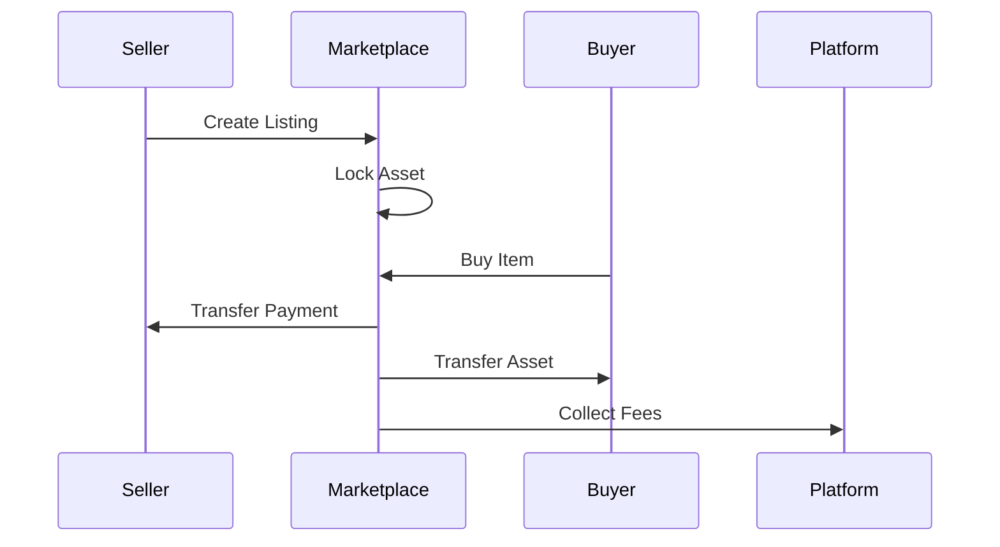
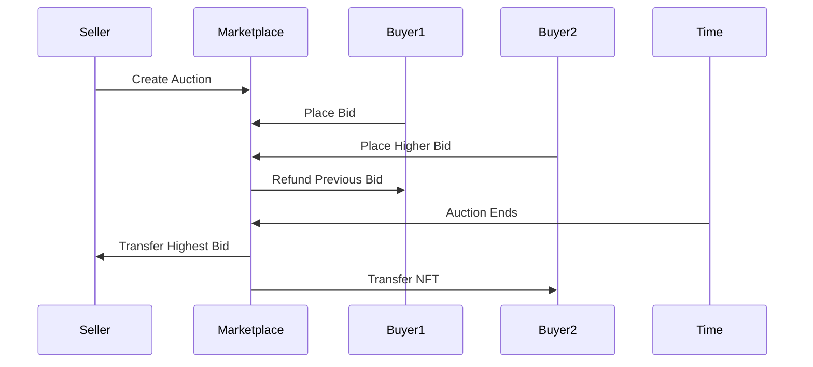
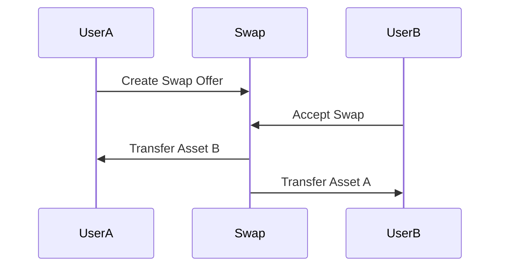

# Trading System Architecture Design

## Overview
Flux Trading System is a decentralized P2P trading platform for tokens and NFTs, enabling secure exchanges with escrow mechanism and multi-asset support.

## System Components

### 1. Core Trading Contracts

#### FluxMarketplace (Main Contract)
- Central trading hub for all asset types
- Manages listings, offers, and executions
- Integrates with token and NFT contracts

#### TokenSwap (ERC-20 Trading)
- Direct token-to-token swaps
- Price oracle integration
- Partial fill support

#### NFTMarketplace (ERC-721/1155 Trading)
- Fixed price sales
- Auction system
- Bundle trading

### 2. Trading State Machine

```
States:
- CREATED: Initial listing/offer creation
- ACTIVE: Available for trading
- PARTIALLY_FILLED: For divisible orders
- FILLED: Completed trade
- CANCELLED: Cancelled by creator
- EXPIRED: Time limit exceeded
```

### 3. Data Structures

#### Listing Structure
```solidity
struct Listing {
    uint256 listingId;
    address seller;
    AssetType assetType;
    address assetContract;
    uint256 tokenId;        // For NFTs
    uint256 amount;         // For tokens/ERC-1155
    address paymentToken;
    uint256 price;
    uint256 deadline;
    ListingStatus status;
}
```

#### Offer Structure
```solidity
struct Offer {
    uint256 offerId;
    uint256 listingId;
    address buyer;
    uint256 offerAmount;
    uint256 quantity;
    uint256 expiration;
    OfferStatus status;
}
```

#### Trade Structure
```solidity
struct Trade {
    uint256 tradeId;
    uint256 listingId;
    address seller;
    address buyer;
    uint256 executedPrice;
    uint256 executedQuantity;
    uint256 timestamp;
    uint256 platformFee;
    uint256 royaltyFee;
}
```

## Escrow Pattern

### 1. Asset Locking
- Seller's assets locked in contract upon listing
- Buyer's payment locked upon offer acceptance
- Automatic release upon successful trade

### 2. Security Features
- ReentrancyGuard on all state-changing functions
- Pull payment pattern for withdrawals
- Signature verification for off-chain orders

### 3. Fee Structure
```
Platform Fee: 2.5% (Configurable)
Royalty Fee: As per NFT contract (ERC-2981)
Distribution:
- 70% to Treasury
- 30% to Stakers
```

## Trading Flows

### 1. Fixed Price Sale Flow


### 2. Auction Flow


### 3. P2P Swap Flow


## Event Architecture

### Core Events
```solidity
event ListingCreated(uint256 indexed listingId, address indexed seller, address indexed assetContract);
event ListingCancelled(uint256 indexed listingId);
event ListingUpdated(uint256 indexed listingId, uint256 newPrice);

event OfferCreated(uint256 indexed offerId, uint256 indexed listingId, address indexed buyer);
event OfferCancelled(uint256 indexed offerId);

event TradeExecuted(uint256 indexed tradeId, uint256 indexed listingId, address buyer, uint256 price);
event FeesCollected(uint256 platformFee, uint256 royaltyFee);
```

## Price Oracle Integration

### 1. Supported Oracles
- Chainlink Price Feeds
- Uniswap V3 TWAP
- Custom game asset pricing

### 2. Price Validation
- Slippage protection (configurable %)
- Min/max price bounds
- Stale price detection

## Security Considerations

### 1. Access Control
- ADMIN_ROLE: Fee updates, emergency pause
- OPERATOR_ROLE: Oracle management
- User permissions via signatures

### 2. Attack Vectors Mitigated
- Front-running: Commit-reveal for auctions
- Price manipulation: Oracle redundancy
- Reentrancy: Check-effects-interactions
- Signature replay: Nonce tracking

### 3. Emergency Features
- Pause mechanism
- Asset recovery (time-locked)
- Trade reversal (dispute period)

## Gas Optimization

### 1. Storage Patterns
- Packed structs
- Mapping over arrays where possible
- IPFS for metadata

### 2. Batch Operations
- Multi-listing creation
- Bulk cancellations
- Aggregated fee claims

### 3. Off-chain Components
- Order matching engine
- Price indexing
- Trade history

## Integration Points

### 1. FluxToken Integration
- Native currency for fees
- Staking rewards distribution
- Governance voting power

### 2. FluxGameAsset Integration
- Royalty enforcement
- Metadata validation
- Rarity-based pricing

### 3. External Protocols
- DEX liquidity (Uniswap/QuickSwap)
- Lending protocols (Aave)
- Bridge contracts

## Upgrade Path

### 1. Proxy Pattern
- UUPS upgradeable
- Storage gap for future variables
- Version tracking

### 2. Migration Strategy
- Gradual feature rollout
- Backward compatibility
- User fund safety

## Implementation Phases

### Phase 1: Core Trading (Current)
- Basic buy/sell functionality
- Token and NFT support
- Fee collection

### Phase 2: Advanced Features
- Auctions
- Bundle trading
- Cross-chain support

### Phase 3: DeFi Integration
- Liquidity pools
- Yield farming
- Lending/borrowing